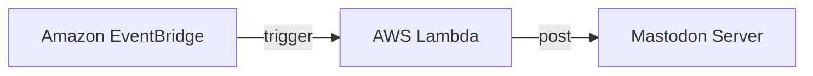

# mastodon-jihou-bot (Mastodon 時報 Bot)

`mastodon-jihou-bot` is a Mastodon bot that posts the time every hour.

This bot is running on [@jihou@social.fohte.net](https://social.fohte.net/@jihou).

## Architecture

This bot is running on AWS Lambda function and triggered by Amazon EventBridge every hour.

## Usage

### 1. Create a Mastodon account for the bot

Create a Mastodon account for the bot manually. You can use any Mastodon server you like.

### 2. Create a Mastodon application

Go to `https://<mastodon-domain>/settings/applications/new` and create an application with your bot account. The only permission you need is `write:statuses`.

### 3. Create a Lambda function and EventBridge

Create a Lambda function and EventBridge with the following settings:

- Runtime: `provided.al2`
- Architecture: `arm64`
- Handler: `index.handler`
- Timeout: `10 sec` (or more)
- Memory: `128 MB` (minimum)
- Environment Variables:
    - `MASTODON_ACCESS_TOKEN`: Access token of the Mastodon application
- Cron: `0 * * * ? *` (every hour)
